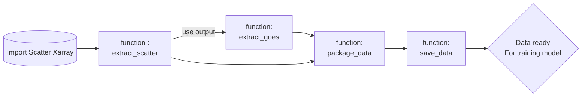

# Quickstart

The following functions outline the main functionality of this Python package. The workflow that is recommended is :



---

## extract_scatter

    extract_scatter(polar_data,start_datetime,end_datetime,lat_range,lon_range)

### Description

This function extracts the scatterometer data from the polar_data dataset.
The function extracts the scatterometer data for the given time range, latitude range and longitude range.
The function then saves the data into 4 numpy files : time of observation, latitude, longitude and main variable.

### Parameters

    polar_data (xarray.Dataset): The scatterometer dataset (ASCAT, HYSCAT etc).
    start_datetime (str): The start time of the data extraction in the format 'YYYY-MM-DD HH:MM:SS'.
    end_datetime (str): The end time of the data extraction in the format 'YYYY-MM-DD HH:MM:SS'.
    lat_range (list): The latitude range of the data extraction in the format [min_lat, max_lat].
    lon_range (list): The longitude range of the data extraction in the format [min_lon, max_lon].
    main_variable (str): The main variable to be extracted. This can be wind_speed, wind_direction etc.

### returns

observation_times (numpy.ndarray): The time of observation of the scatterometer data.
    observation_lats (numpy.ndarray): The latitude of the scatterometer data.
    observation_lons (numpy.ndarray): The longitude of the scatterometer data.
    observation_main_parameter (numpy.ndarray): The wind speed of the scatterometer data.
-----------------------------------------------------------------------------------------

## extract_goes

```python
extract_goes(observation_times,observation_lats,obseration_lons,channels,polar_data)

```

### Description

This function extracts the GOES data from the observation data provided by the extract_scatter function.
These are observation times, latitudes, longitudes.
The function will download the GOES data from the AWS S3 bucket and extract the data for the given observation times.
The function will then subset the GOES data to the observation latitudes and longitudes.
This will be done for all the channels provided in the channels list.
The function will return a numpy array containing all channel images corresponding to the observation data.

### Parameters

    observation_times (numpy.ndarray): The times of observation of the scatterometer data.
    observation_lats (numpy.ndarray): The latitudes of the scatterometer data.
    observation_lons (numpy.ndarray): The longitudes of the scatterometer data.
    channels (list): The channels of interest. multiple channels can be given in form ['C01', 'C02', etc]
    polar (xarray.Dataset): The scatterometer dataset (ASCAT, HYSCAT etc).

### Returns

    images (numpy.ndarray): The GOES images corresponding to the observation data.

---

# package_data

    package_data(images, observation_lats, observation_lons, observation_times, observation_wind_speeds, filter=True, solar_conversion=True)

## Description

This function packages the images and numerical data into a format that can be used for training a machine learning model.
The function will filter out invalid images and fill in any NaN values. (Invalid images = empty images from GOES data)
The function will also convert the observation times, latitudes and longitudes to solar angles (sza, saa) if solar_conversion is set to True.
The function will return the images and numerical data in a numpy array format.

## Parameters

    images (numpy.ndarray): The GOES images corresponding to the observation data.
    observation_lats (numpy.ndarray): The latitudes of the scatterometer data.
    observation_lons (numpy.ndarray): The longitudes of the scatterometer data.
    observation_times (numpy.ndarray): The times of observation of the scatterometer data.
    observation_main_parameter (numpy.ndarray): the main parameter of the scatterometer data (the target of the model).

## Returns

    images (numpy.ndarray): The GOES images corresponding to the observation data.
    numerical_data (numpy.ndarray): The numerical data corresponding to the observation data. (sza, saa, main_parameter if solar_conversion is set to True or lat, lon, time, wind_speeds if solar_conversion is set to False)

---

## **save_data**

    save_data(images, numerical_data, polar_data, start_datetime, end_datetime,channels)

### Description

The function will save the images and numerical data in a compressed numpy file format.
The function will save the data in a folder called output_processed_data.
The function will also save the data with the satellite name, channels, start and end datetime in the filename.

### Parameters

    images (numpy.ndarray): The GOES images corresponding to the observation data.
    numerical_data (numpy.ndarray): The numerical data corresponding to the observation data.
    polar_data (xarray.Dataset): The scatterometer dataset (ASCAT, HYSCAT etc). Used for metadata.
    start_datetime (str): The start time of the data extraction in the format 'YYYY-MM-DD HH:MM:SS'. Used for metadata
    end_datetime (str): The end time of the data extraction in the format 'YYYY-MM-DD HH:MM:SS'. Used for metadata
    channels (list): The channels of interest. multiple channels can be given in form ['C01', 'C02', etc]. Used for metadata

### Returns

    None

<style>#mermaid-1735757657506{font-family:sans-serif;font-size:16px;fill:#333;}#mermaid-1735757657506 .error-icon{fill:#552222;}#mermaid-1735757657506 .error-text{fill:#552222;stroke:#552222;}#mermaid-1735757657506 .edge-thickness-normal{stroke-width:2px;}#mermaid-1735757657506 .edge-thickness-thick{stroke-width:3.5px;}#mermaid-1735757657506 .edge-pattern-solid{stroke-dasharray:0;}#mermaid-1735757657506 .edge-pattern-dashed{stroke-dasharray:3;}#mermaid-1735757657506 .edge-pattern-dotted{stroke-dasharray:2;}#mermaid-1735757657506 .marker{fill:#333333;}#mermaid-1735757657506 .marker.cross{stroke:#333333;}#mermaid-1735757657506 svg{font-family:sans-serif;font-size:16px;}#mermaid-1735757657506 .label{font-family:sans-serif;color:#333;}#mermaid-1735757657506 .label text{fill:#333;}#mermaid-1735757657506 .node rect,#mermaid-1735757657506 .node circle,#mermaid-1735757657506 .node ellipse,#mermaid-1735757657506 .node polygon,#mermaid-1735757657506 .node path{fill:#ECECFF;stroke:#9370DB;stroke-width:1px;}#mermaid-1735757657506 .node .label{text-align:center;}#mermaid-1735757657506 .node.clickable{cursor:pointer;}#mermaid-1735757657506 .arrowheadPath{fill:#333333;}#mermaid-1735757657506 .edgePath .path{stroke:#333333;stroke-width:1.5px;}#mermaid-1735757657506 .flowchart-link{stroke:#333333;fill:none;}#mermaid-1735757657506 .edgeLabel{background-color:#e8e8e8;text-align:center;}#mermaid-1735757657506 .edgeLabel rect{opacity:0.5;background-color:#e8e8e8;fill:#e8e8e8;}#mermaid-1735757657506 .cluster rect{fill:#ffffde;stroke:#aaaa33;stroke-width:1px;}#mermaid-1735757657506 .cluster text{fill:#333;}#mermaid-1735757657506 div.mermaidTooltip{position:absolute;text-align:center;max-width:200px;padding:2px;font-family:sans-serif;font-size:12px;background:hsl(80,100%,96.2745098039%);border:1px solid #aaaa33;border-radius:2px;pointer-events:none;z-index:100;}#mermaid-1735757657506:root{--mermaid-font-family:sans-serif;}#mermaid-1735757657506:root{--mermaid-alt-font-family:sans-serif;}#mermaid-1735757657506 flowchart{fill:apa;}</style>
