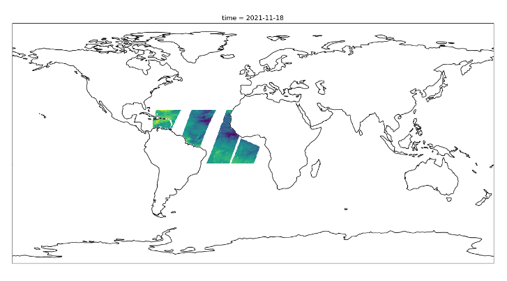

# PolarGeosAI

Machine learning for satellite remote sensing. Easy extraction and processing of matching GOES geostationary satellite and polar orbiting scatterometer data for model training.

---

# Introduction
This package streamlines the process of extracting GOES satellite data that aligns in time and location with the orbit of a scatterometer satellite. By matching these datasets, parameters measured by the scatterometer can be used as training data for machine learning models based on GOES imagery.

Key features of the package include:

* Efficient Data Extraction: Retrieves only the relevant portions of GOES data from AWS Open Data, avoiding the need to download entire large files.
* Automated Data Preparation: Prepares the extracted data for direct use in machine learning workflows.
* Flexible Output:
    * Seamlessly integrates with pre-provided neural networks for training on selected data.
    * Outputs can also be exported for use in other workflows or custom machine learning models.

This package simplifies working with large GOES satellite datasets, making it easier to train and deploy machine learning models.

# Commands

* `mkdocs new [dir-name]` - Create a new project.
* `mkdocs serve` - Start the live-reloading docs server.
* `mkdocs build` - Build the documentation site.
* `mkdocs -h` - Print help message and exit.

## Project layout

    mkdocs.yml    # The configuration file.
    docs/
        index.md  # The documentation homepage.
        ...       # Other markdown pages, images and other files.
